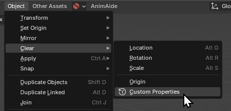
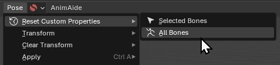

<h1 tabindex="-1" class="heading-element" dir="auto">
    
    Reset Custom Properties
</h1>

[)](https://github.com/Lauloque/bl_reset_custom_properties/blob/master/LICENSE) ) 

Similar to how Blender lets us reset or clear translation, rotation and scale, this Blender extension provides operators to reset custom properties to their default values on objects and pose bones. Compatible with Blender 4.2 and up.

Adds convenient menu items in Object and Pose modes for quick property management.

Menu _Object_ &rang; _Clear_ &rang; _Custom Properties_:  

Menu _Pose_ &rang; _Reset Custom Properties_:  
    - Selected Bones  
    - All Bones  

## Installation

You can download the extension either from:

- Blender's GUI (Preferences > Get Extensions)
- The [Blender Extension Platform](https://extensions.blender.org/add-ons/reset_custom_properties/) (to be published!)
- [This repository's releases page](https://github.com/Lauloque/bl_reset_custom_properties/releases).

The installation process is well explained by Blender's official extensions platform documentation:

[About — Blender Extensions](https://extensions.blender.org/about/)
